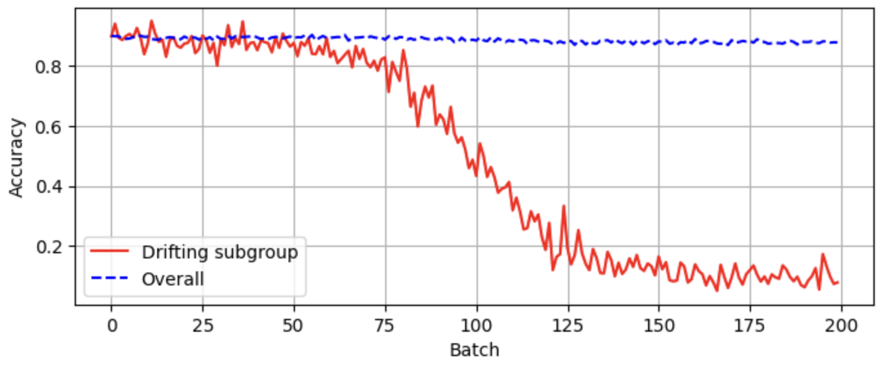

## Subgroup Agrawal Drift 

This repository contains the code and data for the paper "A Synthetic Benchmark to Explore Limitations of Localized Drift Detections", by Flavio Giobergia, Eliana Pastor, Luca de Alfaro, Elena Baralis. 

### How to use
The main library requirements are provided in requirements.txt.

A running example is provided in [examples.ipynb](examples.ipynb).

You can use the `SubgroupAgrawalDrift` class from drift_agrawal.py to generate synthetic data with localized drifts. The class has the following parameters:

- `sg_size` (default 0.1), the fraction of the entire dataset that should be approximately covered by the generated subgroup. Note that this is the *desired* size; the actual size can vary slightly (as explained in the paper)
- `perturbation` (default 0.0), the probability that noise will happen in the generation. Each new sample will be perturbed by the magnitude of `perturbation`. Valid values are in the range [0.0, 1.0] (this parameter is passed directly to river's [Agrawal stream generator](https://riverml.xyz/latest/api/datasets/synth/Agrawal/) and should be used to make the original problem non-trivial). 
- `position` (default 5000), the position of the drift in the stream (the drift is represented as a sigmoid, and this parameter represents the position of the inflection point of the sigmoid)
- `width` (default 1000), the width of the drift in the stream (the drift is represented as a sigmoid, and this parameter represents the width of the sigmoid, i.e. the gap between the 0.02 and 0.98 values of the sigmoid)

The class has the following methods:
- `take(self, n : int, drift_info : bool = False)`, which generates `n` samples and returns them as `x`, `y` values. If `drift_info` is set to True, the method will return `x`, `y`, `in target subgroup`, `has drifted`, where `in target subgroup` is a boolean value stating whether the current sample belongs to the drifting subgroup, and `has drifted` is a boolean value stating whether the current point has been affected by drift or not.

### Other details
Note that the tolerance and the maximum number of iterations cannot currently be specified in the constructor. They are, however, parameters of the `pick_subgroup` method, which is called internally by the constructor. If you need to change these parameters, you can modify the `pick_subgroup` method, or the constructor's call, directly.

### Experimental results
This repository also contains the code to replicate the results presented in the paper. 

In particular, the following files are provided.

- `run.py`: runs various drift detection techniques (with parameters that can be specified with `--models-file`) on SAD. The results are saved in various files stored in the directory specified with `--outdir`. The script can be run with `python run.py --models-file models.json --outdir results`. Examples of model files are provided in the `configs` directory.
- `experiments.sh`: bash script that runs `run.py` to produce the results shown in the paper.`
- `drift-viz.ipynb`: a Jupyter notebook that can be used to generate a visualization of the performance (global and local -- for the drifting subgroup -- accuracy) of a model, as drift occurs over time (figure shown above). This notebook can be used as a starting point to generate a subgroup-drifting stream.
- `plot-results.ipynb`: a Jupyter notebook that can be used to generate the plots of the results presented in the paper.
- `examples.ipynb`: a Jupyter notebook that shows some information about the generated subgroups (e.g., how much their support deviates from the target -- desired -- one)